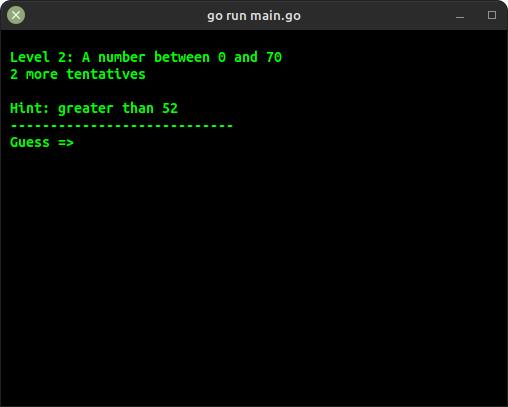

# Guess The Number
Guess the number is a game made with the language Go where you have to guess the correct number between a range of values. When playing, the game will give you hints to help you reach the desired number.



An example of its interface.

## How to Test
For testing the game you only must have a version of the go compiler installed on your machine, then you can use the following commands:

```bash
go run main.go
```
Or you can compile it first and then execute the binary format:
```bash
go build main.go
./main
```
*When compiling you can execute the first line just one time and then call it whenever you want using the binary file.